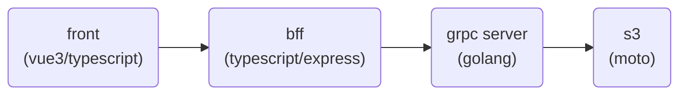

# GRPC-S3 サンプル

## 構成



## 実行方法

```bash
# grpsサーバー起動
$ docker-compose up -d
$ docker compose exec grpc-server /bin/bash
/app # ./scripts/start-server.sh
```

```bash
# evans起動
$ docker compose exec grpc-server /bin/bash
/app # ./scripts/repl.sh
```

## bff の起動

```bash
$ docker compose exec grpc-bff /bin/bash
/app # yarn install
/app # yarn start
```

## front の起動

```bash
$ docker compose exec grpc-front /bin/bash
/app # yarn install
/app # yarn dev
```

## gRPCコード生成

```bash
$ docker compose exec grpc-server /bin/bash
/app # yarn install
/app # ./scripts/genproto.sh
```
