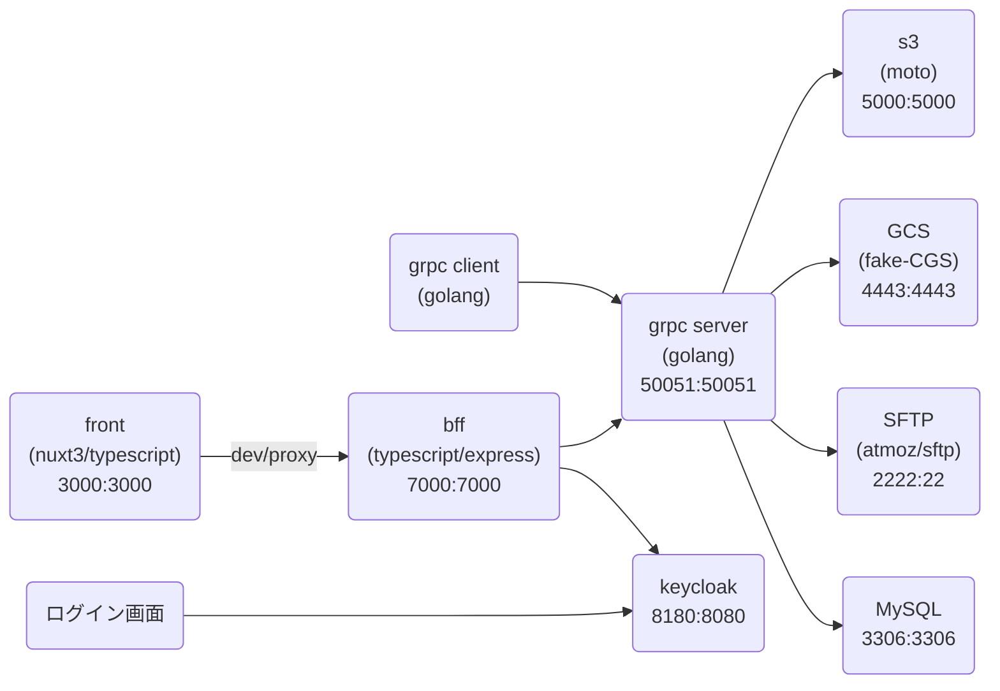

# GRPC-S3 サンプル

## 構成



## 実行方法

docker-compose up -d で開発用のコンテナが稼働する。コンテナのメモリは3Gは欲しい。

```bash
$ docker-compose up -d
```

## gRPC の起動

```bash
# grpsサーバー起動
$ docker compose exec grpc-server /bin/bash
# S3 使用の場合
/app # ./scripts/start-server.sh
# GCS 使用の場合
/app # ./scripts/start-server.sh gcs
# SFTP 使用の場合
/app # ./scripts/start-server.sh sftp
```

```bash
# evans起動
$ docker compose exec grpc-server /bin/bash
/app # ./scripts/repl.sh
```

## bff の起動

```bash
$ docker compose exec grpc-bff /bin/bash
/app # yarn install
/app # yarn start
```

## front の起動

```bash
$ docker compose exec grpc-front /bin/bash
/app # yarn install
/app # yarn dev
```

## keycloakのセットアップ

フロントとBFFのソースコード中の「useKeycloak」をtrueにすると KeyCloak が有効になる

```bash
# レルムとアカウントの設定を読み込む
$ ./scripts/keycloak-import.sh
```

ちなみに書き出しは以下

```bash
# レルムとアカウントの設定を書き出す
$ ./scripts/keycloak-export.sh
```

Dcoker 内で認可できるように grpc-buff/node_modules/keycloak-connect/middleware/auth-utils/grant-manager.js の以下のコードをコメントアウト

```js
                       :
    } else if (token.content.iss !== this.realmUrl) {
      reject(new Error('invalid token (wrong ISS)'))
                       :
```

以下のURLで keycloak を開き id:admin pass:admin でログイン
testレルムにユーザーを追加する。

http://localhost:8180

## gRPC コード生成

```bash
$ docker compose exec grpc-server /bin/bash
/app # yarn install
/app # ./scripts/genproto.sh
```

## Windowsの場合の注意

Windows のシェルではパスを自動的に変換してしまうため正常に動作しない。
パスの先頭に「//」を付けるか、環境変数に　MSYS_NO_PATHCONV=1　を設定して実行する。
