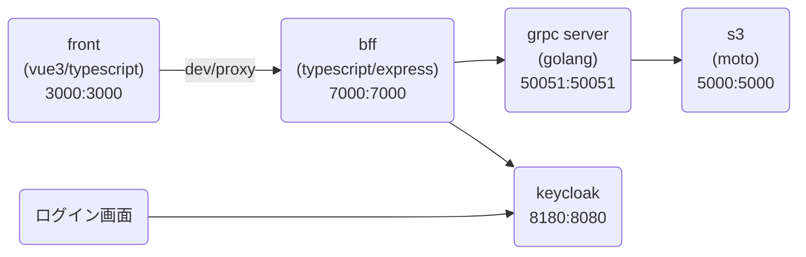

# GRPC-S3 サンプル

## 構成



## 実行方法

```bash
# grpsサーバー起動
$ docker-compose up -d
$ docker compose exec grpc-server /bin/bash
/app # ./scripts/start-server.sh
```

```bash
# evans起動
$ docker compose exec grpc-server /bin/bash
/app # ./scripts/repl.sh
```

## bff の起動

```bash
$ docker compose exec grpc-bff /bin/bash
/app # yarn install
/app # yarn start
```

## front の起動

```bash
$ docker compose exec grpc-front /bin/bash
/app # yarn install
/app # yarn dev
```

## gRPCコード生成

```bash
$ docker compose exec grpc-server /bin/bash
/app # yarn install
/app # ./scripts/genproto.sh
```

## keycloakのセットアップ

```bash
# レルムとアカウントの設定を読み込む
$ ./scripts/keycloak-import.sh
```

ちなみに書き出しは以下

```bash
# レルムとアカウントの設定を書き出す
$ ./scripts/keycloak-export.sh
```

Dcoker 内で認可できるように keycloak-connect/middleware/auth-utils/grant-manager.js の以下のコードをコメントアウト

```js
                       :
    } else if (token.content.iss !== this.realmUrl) {
      reject(new Error('invalid token (wrong ISS)'))
                       :
```

以下のURLで keycloak を開き id:admin pass:admin でログイン
testレルムにユーザーを追加する。

http://localhost:8180
